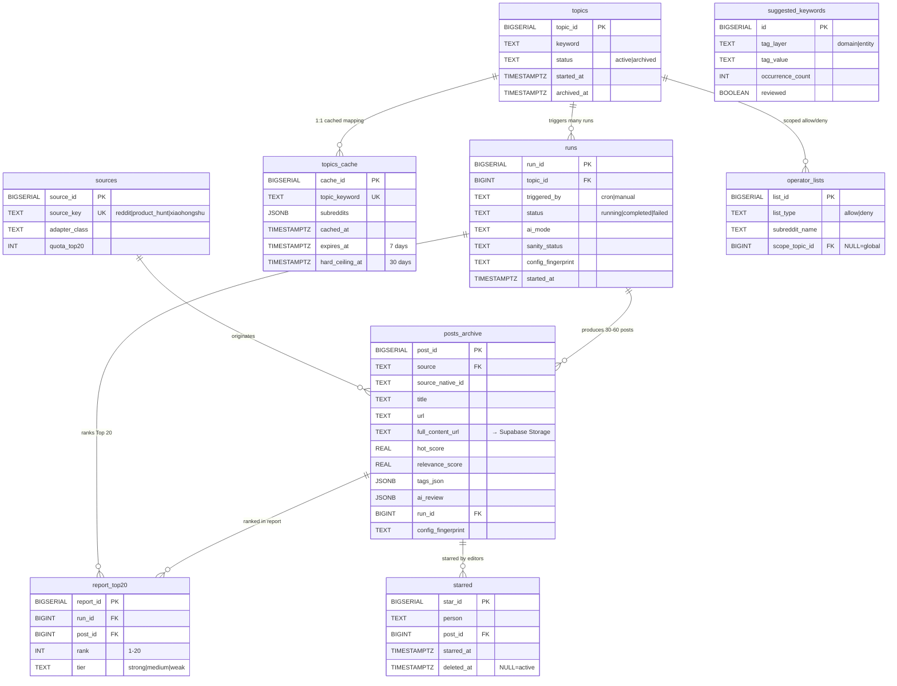

# System ① database schema (Step 1 deliverable)

| Field | Value |
|---|---|
| Version | 0001 (initial) |
| Migration file | `supabase/migrations/0001_init.sql` |
| Table count | **9** |
| Status | Draft for Anna review |
| Source documents | PRD v1 + Cindy schema preview + Richard host/cost research + Anna 2026-05-21 12-item ratification |

---

## 9 tables at a glance

| # | Table | One-line purpose | Main fields |
|---|---|---|---|
| 1 | `sources` | Data-source registry (pluggable abstraction; future adapters like XHS just add a row) | source_key / adapter_class / quota_top20 |
| 2 | `topics` | Topics (active/archived, hard switch, at most 1 active at any time) | keyword / status / started_at / archived_at |
| 3 | `topics_cache` | Topic → subreddit mapping cache (7d TTL + cached_at + 30d hard ceiling) | topic_keyword / subreddits / expires_at |
| 4 | `operator_lists` | Allow/deny list (whitelist/blacklist, global or topic-scoped) | list_type / subreddit_name / scope_topic_id |
| 5 | `runs` | Metadata for each "run" (cron or manual, with sanity status + config_fingerprint) | run_id / topic_id / status / ai_mode / sanity_status |
| 6 | `posts_archive` | Accumulated full set of posts (30-60 per run, with tags_json + ai_review + full_content_url) | post_id / source / hot_score / tags_json / ai_review |
| 7 | `report_top20` | Top-20 report per run (the rendering source for "today's report" on the frontend) | run_id / post_id / rank / tier |
| 8 | `starred` | Chief-editor starred library (per-person + soft delete) | person / post_id / starred_at / deleted_at |
| 9 | `suggested_keywords` | Keyword-list growth tracking (frequent entities/domain terms not yet in the list, monthly operator review) | tag_layer / tag_value / occurrence_count |

---

## ER diagram

---

## Key design decisions (mapped against Anna's 12 ratifications)

| Anna's ratification | Where it lands in the schema |
|---|---|
| ① Topic-driven routine model | `topics` table + `topics.status` + cron reads active topic and triggers `runs` |
| ② Hard switch on topic change | `topics.status='active'` enforced with a partial UNIQUE index (at most 1 active at any time) |
| ③ Independent run per day + archive accumulation | Each cron trigger creates a new row in `runs`; `posts_archive` is append-only |
| ④ Pluggable Source (XHS forward compat) | `sources` table + `posts_archive.source` references `sources.source_key`; adding XHS only requires INSERT + a Python adapter |
| ⑤ Next.js / Vercel / Supabase | Schema is standard PostgreSQL SQL, Supabase-native |
| ⑥ Vercel Hobby + Fluid Compute | Not a schema-layer concern (host decision) |
| ⑦ Supabase PG | ✅ |
| ⑧ full_content moves to Storage | `posts_archive.full_content_url` field (points to compressed JSON in Storage); DB doesn't store the full text |
| ⑨ GPT-4o-mini | Not a schema-layer concern (LLM decision); `runs.ai_mode` records whether it was ai or heuristic |
| ⑩ post_id PK + UNIQUE composite key + FK | `posts_archive.UNIQUE(source, source_native_id)` + all foreign keys reference post_id |
| ⑪ config_fingerprint + UTC + soft delete | `posts_archive.config_fingerprint` (always present) + `TIMESTAMPTZ` (UTC) on every table + `starred.deleted_at NULLABLE` |
| ⑫ 8-step dev plan + checkpoint review | This document is the Step 1 deliverable, awaiting Anna's review |

---

## Capacity estimate (based on Richard's research)

| Mode | Monthly delta (30 runs) | 1-year accumulated | 5-year accumulated |
|---|---|---|---|
| `posts_archive` excluding full_content (raw data ~2KB/row + indexes) | ~6 MB | ~70 MB | ~350 MB |
| `runs` + `report_top20` + `starred` and other small tables | ~1 MB | ~12 MB | ~60 MB |
| **Total (excluding Storage)** | **~7 MB** | **~80 MB** | **~410 MB** ✅ well under the 500MB free-tier line |
| Supabase Storage (full_content compressed JSON) | ~30 MB | ~360 MB | ~1.8 GB (>1GB free tier — to watch) |

→ **DB side is fine for 5 years**; Storage side may need a bump within ~3 years (paid $25/mo or prune old archive when that comes).

---

## Verification (what "Step 1 complete" means)

**Done**:
- ✅ Full CREATE TABLE SQL for all 9 tables (`0001_init.sql`)
- ✅ Primary keys / foreign keys / indexes / constraints / triggers (auto-updating updated_at)
- ✅ Seed: `sources` initialized with Reddit + PH (XHS left empty, added later)
- ✅ ER diagram (Mermaid renders in GitHub / Cursor / VSCode)
- ✅ Landing point documented for each of Anna's 12 ratifications

**Not done (deferred to later steps)**:
- ❌ Applying the SQL to a real Supabase project (Step 8 deployment, once Anna provides Supabase credentials)
- ❌ Python pipeline writing into these tables (Steps 2–4)
- ❌ Next.js API routes reading these tables (Step 6)
