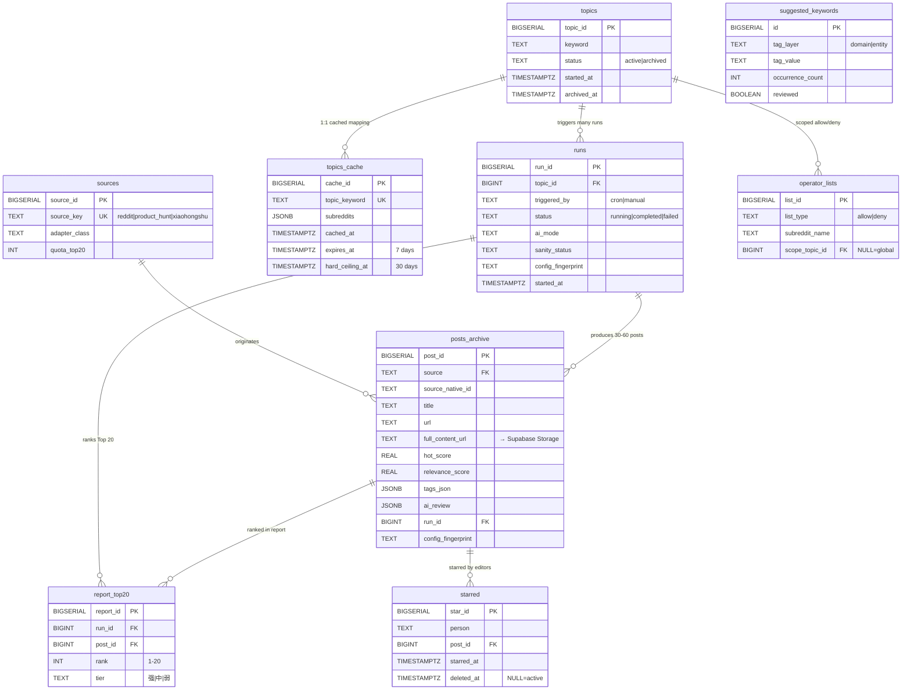

# 系统① 数据库 schema(Step 1 交付)

| 字段 | 内容 |
|---|---|
| 版本 | 0001(initial)|
| migration 文件 | `supabase/migrations/0001_init.sql` |
| 表数量 | **9 张** |
| 状态 | Draft for Anna review |
| 设计依据 | PRD v1 + Cindy schema 前瞻 + Richard host/cost 调研 + Anna 2026-05-21 12 项 ratification |

---

## 9 张表速览

| # | 表 | 一句话作用 | 主要字段 |
|---|---|---|---|
| 1 | `sources` | 数据源注册(可插拔抽象层,XHS 等未来 adapter 加这一行即可) | source_key / adapter_class / quota_top20 |
| 2 | `topics` | 主题(active/archived,hard switch,同一时刻最多 1 个 active) | keyword / status / started_at / archived_at |
| 3 | `topics_cache` | 主题→subreddit 映射缓存(7 天 TTL + cached_at + 30 天 hard ceiling) | topic_keyword / subreddits / expires_at |
| 4 | `operator_lists` | allow/deny list(白/黑名单,可全局 or 按主题 scope) | list_type / subreddit_name / scope_topic_id |
| 5 | `runs` | 每次"跑"的 metadata(cron or manual,带 sanity status + config_fingerprint)| run_id / topic_id / status / ai_mode / sanity_status |
| 6 | `posts_archive` | 帖子全集累积(每 run 30-60 条,带 tags_json + ai_review + full_content_url)| post_id / source / hot_score / tags_json / ai_review |
| 7 | `report_top20` | 每次 run 的 Top 20 报告(前端"今日报告"渲染源) | run_id / post_id / rank / tier |
| 8 | `starred` | 主编精选库(per-人 + soft delete) | person / post_id / starred_at / deleted_at |
| 9 | `suggested_keywords` | 词表生长追踪(高频未入词表的实体/领域词,operator 月度回顾) | tag_layer / tag_value / occurrence_count |

---

## ER 关系图

---

## 关键设计决策(对照 Anna ratify 的 12 条)

| Anna ratify 项 | 在 schema 哪里落地 |
|---|---|
| ① 主题驱动 routine 模式 | `topics` 表 + `topics.status` + cron 读 active topic 触发 `runs` |
| ② 切主题 hard switch | `topics.status='active'` 上加了 partial UNIQUE 索引(同时刻最多 1 个 active) |
| ③ 每天独立 run + archive 累积 | 每次 cron 触发新建一行 `runs`;`posts_archive` 永远只增 |
| ④ Source 可插拔(XHS forward-compat) | `sources` 表 + `posts_archive.source` 引 `sources.source_key`,加 XHS 只需 INSERT 一行 + 写一个 Python adapter |
| ⑤ Next.js / Vercel / Supabase | schema 是 PostgreSQL 标准 SQL,Supabase 原生兼容 |
| ⑥ Vercel Hobby + Fluid Compute | 不在 schema 层(host 决策) |
| ⑦ Supabase PG | ✅ |
| ⑧ full_content 移 Storage | `posts_archive.full_content_url` 字段(指向 Storage 里的压缩 JSON 文件),DB 不存全文 |
| ⑨ GPT-4o-mini | 不在 schema 层(LLM 决策);`runs.ai_mode` 记录是 ai/heuristic |
| ⑩ post_id PK + UNIQUE 复合键 + FK | `posts_archive.UNIQUE(source, source_native_id)` + 所有外键引用 post_id |
| ⑪ config_fingerprint + UTC + soft delete | `posts_archive.config_fingerprint`(必带)+ 所有表 `TIMESTAMPTZ`(UTC)+ `starred.deleted_at NULLABLE` |
| ⑫ 8 步 dev plan + checkpoint review | 本文档就是 Step 1 交付,等 Anna review |

---

## 容量估算(基于 Richard 调研)

| 模式 | 月增量(30 次跑) | 1 年累积 | 5 年累积 |
|---|---|---|---|
| `posts_archive` 不含 full_content(裸数据 ~2KB/行 + 索引) | ~6 MB | ~70 MB | ~350 MB |
| `runs` + `report_top20` + `starred` 等小表 | ~1 MB | ~12 MB | ~60 MB |
| **总(不算 Storage)** | **~7 MB** | **~80 MB** | **~410 MB** ✅ 远低 500MB 红线 |
| Supabase Storage(full_content 压缩 JSON) | ~30 MB | ~360 MB | ~1.8 GB(超 1GB 免费需关注)|

→ **DB 端 5 年充足**;Storage 端 ~3 年内可能要扩(到时候转付费 $25/月 或清旧 archive)。

---

## 验证(Step 1 完成意味着什么)

**做完了**:
- ✅ 9 张表的 CREATE TABLE 完整 SQL(`0001_init.sql`)
- ✅ 主键 / 外键 / 索引 / 约束 / 触发器(updated_at 自动更新)
- ✅ Seed:`sources` 表初始注入 Reddit + PH(XHS 留空,以后加)
- ✅ ER 关系图(Mermaid 在 GitHub/Cursor/VSCode 都能渲染)
- ✅ 对 Anna ratify 12 条全部落地点说明

**没做(留给后续 Step)**:
- ❌ 把 SQL 跑进真正的 Supabase 项目(Step 8 部署时 Anna 提供 Supabase 账号)
- ❌ Python 主线写数据进这些表(Step 2-4)
- ❌ Next.js API routes 读这些表(Step 6)
